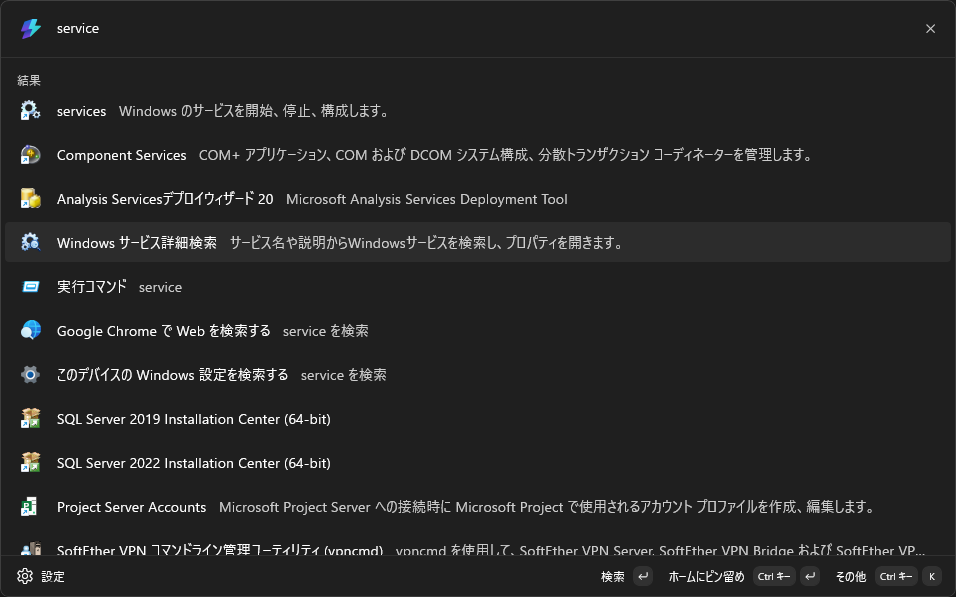
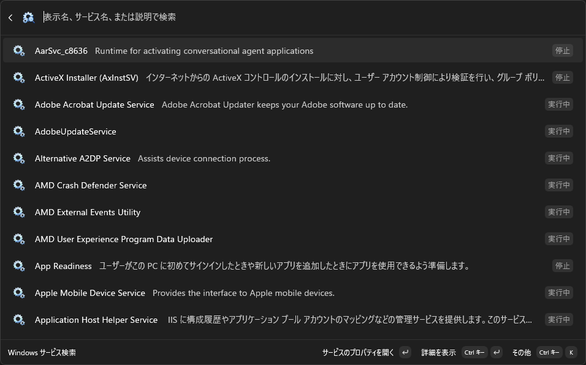
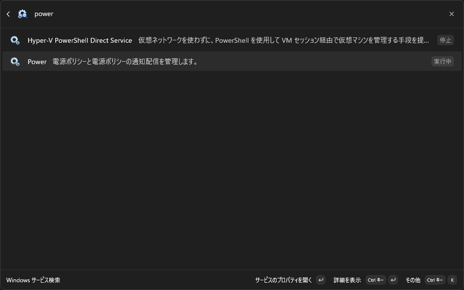
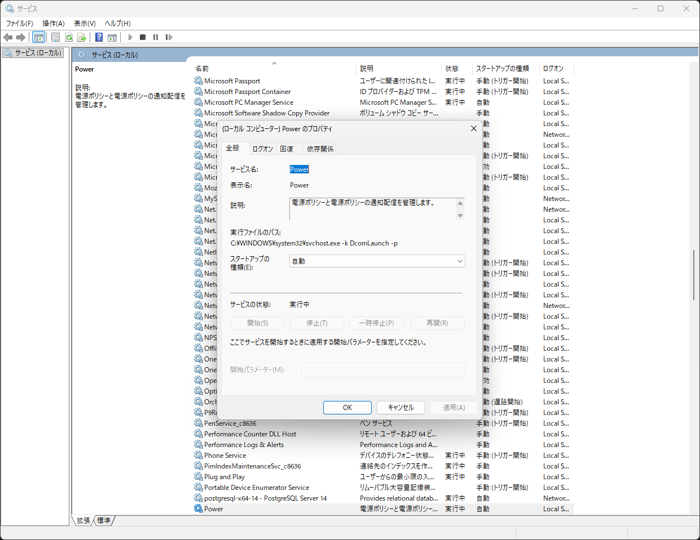

# PowerToys Command Palette 用 Windows サービス検索

[English](README.md)

Windows サービスを、表示名、サービス名、説明から [Microsoft PowerToys の Command Palette](https://learn.microsoft.com/ja-jp/windows/powertoys/command-palette/overview) で検索し、選択したサービスのプロパティを `services.msc` で直接開く拡張機能です。

Command Palette は Microsoft PowerToys に含まれる、キーボード中心のランチャーです。アプリ、コマンド、ファイル、拡張機能が提供するツールなどを1か所から検索できます。既定では <kbd>Win</kbd>+<kbd>Alt</kbd>+<kbd>Space</kbd> で開きます。

## インストール

[Microsoft Store から Services Search for Command Palette を入手](https://apps.microsoft.com/detail/9NSDXBJF48KV)

## 主な機能

- インストールされている Windows サービスを、表示名、サービス名、説明から検索できます。
- `印刷`、`更新`、`Bluetooth`、`ネットワーク`、`バックアップ`など、サービスの用途を表す言葉から探せます。
- 大文字と小文字を区別しない部分一致により、入力中にすばやく絞り込めます。
- 検索結果で、サービスの説明、現在の状態、スタートアップの種類を確認できます。
- 「サービス」管理画面を手動で探さず、該当するサービスのプロパティを開けます。
- Windows 10 version 2004（ビルド 19041）以降の x64 / ARM64 に対応し、日本語と英語で利用できます。

## 使い方

1. <kbd>Win</kbd>+<kbd>Alt</kbd>+<kbd>Space</kbd> で PowerToys Command Palette を開きます（ショートカットは PowerToys の設定で変更できます）。
2. `service` と入力し、**Windows サービス詳細検索**を選択します。
3. 表示名、サービス名、説明を入力します。たとえば `power`、`Bluetooth`、`ネットワーク`、`バックアップ`で検索できます。
4. 検索結果を選び、表示された場合は UAC の確認を承認します。
5. Windows 標準のサービスプロパティ画面で内容を確認します。

この拡張機能が行うのは、選択したサービスを探してプロパティ画面を開くところまでです。サービスの開始、停止、再起動、削除、設定変更は行いません。

## 画面イメージ

| `service` で拡張機能を検索 | Windows サービスの一覧を表示 |
| :---: | :---: |
| [](docs/images/ja-JP/01-command-palette-service-search.png) | [](docs/images/ja-JP/02-windows-services-search-open.png) |
| **`power` でサービスを絞り込み** | **選択したサービスのプロパティを開く** |
| [](docs/images/ja-JP/03-filter-services-power.png) | [](docs/images/ja-JP/04-open-service-properties.png) |

## 動作要件

- Windows 10 version 2004（ビルド 19041）以降
- Command Palette を有効にした [Microsoft PowerToys](https://learn.microsoft.com/ja-jp/windows/powertoys/install)

利用できる Windows サービスは、Windows のバージョン、インストール済みソフトウェア、デバイス構成、表示言語によって異なります。この拡張機能は、現在の Windows 環境から取得したサービス情報を検索します。

## 仕組み

拡張機能は、Windows に登録されたサービス一覧を管理者権限なしで取得し、入力中にすばやく絞り込めるようメモリ上に保持します。表示名と説明は、可能な場合に Windows リソースから展開されるため、現在の Windows 表示言語に従います。

検索結果を選択すると、`services.msc` を起動し、サービスの内部名と起動した管理画面のプロセス ID を昇格ヘルパーへ送ります。ヘルパーは Windows UI Automation により対象サービスを選択して、標準のプロパティダイアログを開きます。管理者権限はこの画面操作にだけ使用され、サービス自体の設定は変更しません。

## 開発

### 必要な環境

- Windows 10 version 2004 以降
- [.NET 10 SDK](https://dotnet.microsoft.com/download/dotnet/10.0)
- パッケージの作成または配置を行う場合は、Windows アプリケーション開発と MSIX ツールを含む Visual Studio

### ビルドとテスト

リポジトリのルートで実行します。

```powershell
dotnet restore
dotnet build WindowsServicesSearch/WindowsServicesSearch.csproj -p:Platform=x64
```

Command Palette で動作確認するには、Visual Studio で `WindowsServicesSearch.slnx` を開き、`x64` または `ARM64` を選んで **ビルド > 配置**を実行します。通常のビルドだけでは拡張機能は登録されません。配置後、Command Palette で **Reload Command Palette extensions**を実行してください。

## ドキュメント

- [Microsoft Store リリース手順](docs/StoreRelease.md)
- [プライバシー ポリシー](docs/PrivacyPolicy.md)

## コントリビューション

Issue と Pull Request を歓迎します。ユーザー向けの文言を変更するときは、英語と日本語の両方のリソースを更新してください。サービス画面の操作を変更するときは、言語に依存しない UI Automation プロパティが利用できる場合、表示文字列に依存する処理を追加せずに `services.msc` で動作確認してください。

## ライセンス

このプロジェクトは [MIT License](LICENSE) のもとで公開されています。
