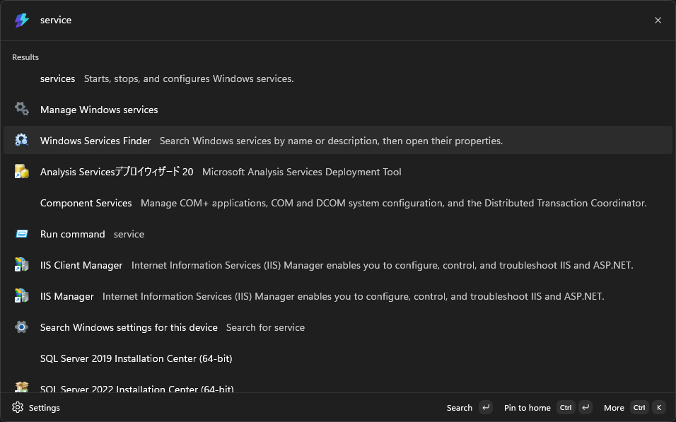
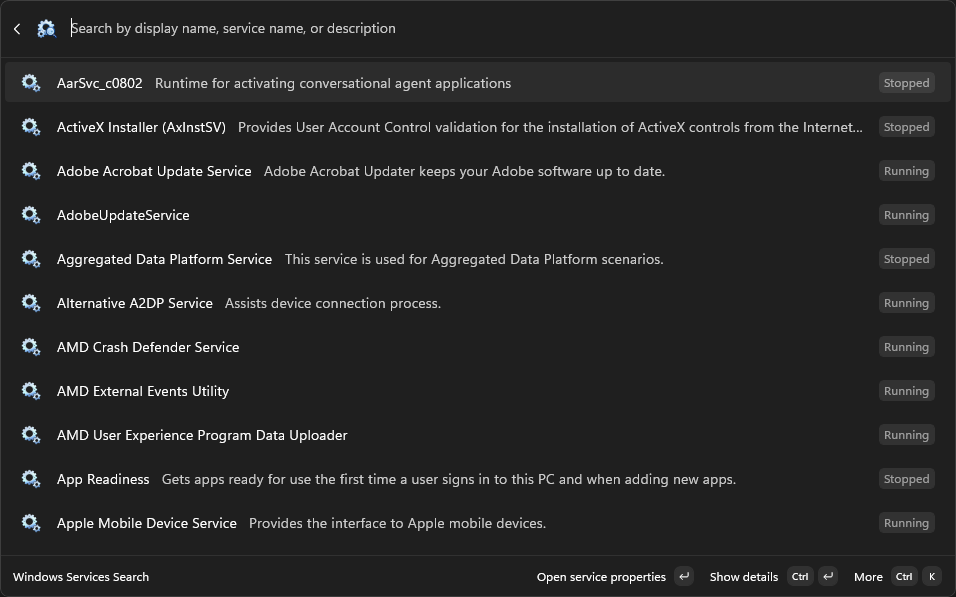
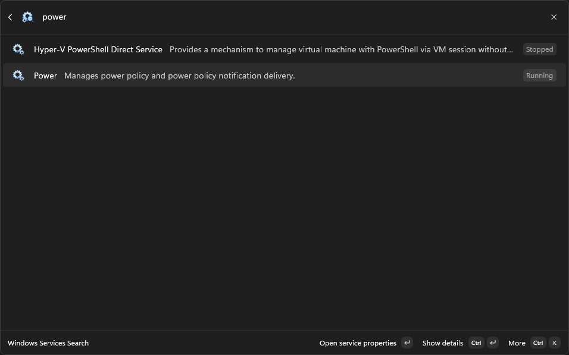
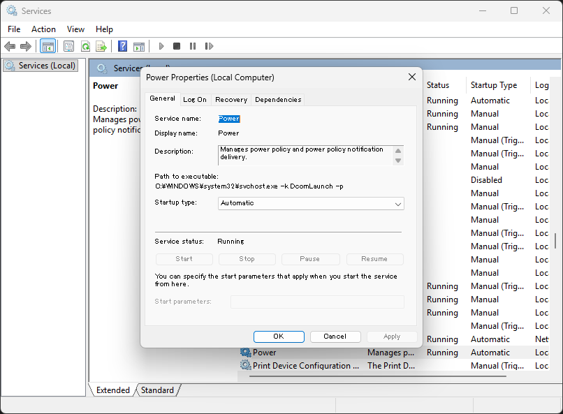

# Windows Services Search for PowerToys Command Palette

[日本語](README.ja.md)

Search Windows services from [Microsoft PowerToys Command Palette](https://learn.microsoft.com/windows/powertoys/command-palette/overview) by display name, service name, or description, and open the selected service's properties directly in `services.msc`.

Command Palette is a keyboard-first launcher included with Microsoft PowerToys. It lets you find apps, commands, files, and extension-provided tools from one place. By default, press <kbd>Win</kbd>+<kbd>Alt</kbd>+<kbd>Space</kbd> to open it.

## Features

- Search installed Windows services by display name, service name, and description.
- Find services by purpose with terms such as `printing`, `updates`, `Bluetooth`, `network`, or `backup`.
- Use case-insensitive partial matching for fast filtering as you type.
- View each service's description, current status, and startup type in the results.
- Open the matching service's properties instead of navigating the Services console manually.
- Support English and Japanese on x64 and ARM64 devices running Windows 10 version 2004 (build 19041) or later.

## Usage

1. Open PowerToys Command Palette with <kbd>Win</kbd>+<kbd>Alt</kbd>+<kbd>Space</kbd> (the shortcut can be changed in PowerToys settings).
2. Enter `service` and select **Windows Services Finder**.
3. Enter a display name, service name, or description—for example, `power`, `Bluetooth`, `network`, or `backup`.
4. Select a result and approve the UAC prompt if it appears.
5. Review the service in the standard Windows Services properties window.

The extension only finds the selected service and opens its properties dialog. It does not start, stop, restart, delete, or change the configuration of any service.

## Screenshots

| Find the extension with `service` | Browse Windows services |
| :---: | :---: |
| [](docs/images/en-US/01-command-palette-service-search.png) | [](docs/images/en-US/02-windows-services-search-open.png) |
| **Filter services with `power`** | **Open the selected service's properties** |
| [](docs/images/en-US/03-filter-services-power.png) | [](docs/images/en-US/04-open-service-properties.png) |

## Requirements

- Windows 10 version 2004 (build 19041) or later
- [Microsoft PowerToys](https://learn.microsoft.com/windows/powertoys/install) with Command Palette enabled

Windows services vary by Windows version, installed software, device configuration, and display language. The extension searches the service information provided by the current Windows installation.

## How it works

The extension reads the installed service catalog from Windows without requiring elevation and keeps it in memory for fast filtering. Display names and descriptions are resolved from Windows resources where available, so they follow the current Windows language.

When you select a result, the extension opens `services.msc` and sends the service's internal name and the launched console's process ID to an elevated helper. The helper uses Windows UI Automation to select the matching service and open its standard properties dialog. Administrator privileges are used only for this navigation; the extension does not change the service.

## Development

### Prerequisites

- Windows 10 version 2004 or later
- [.NET 10 SDK](https://dotnet.microsoft.com/download/dotnet/10.0)
- Visual Studio with Windows application and MSIX tooling when packaging or deploying the app

### Build and test

From the repository root:

```powershell
dotnet restore
dotnet build WindowsServicesSearch/WindowsServicesSearch.csproj -p:Platform=x64
```

To test the extension in Command Palette, open `WindowsServicesSearch.slnx` in Visual Studio, select `x64` or `ARM64`, and use **Build > Deploy**. A normal build does not register the extension. After deployment, run **Reload Command Palette extensions** in Command Palette.

## Documentation

- [Microsoft Store release process](docs/StoreRelease.md)
- [Privacy policy](docs/PrivacyPolicy.md)

## Contributing

Issues and pull requests are welcome. When changing user-facing text, update both the English and Japanese resources. Changes to service navigation should be tested against `services.msc` without adding locale-dependent UI labels when a language-independent UI Automation property is available.

## License

This project is licensed under the MIT License.
